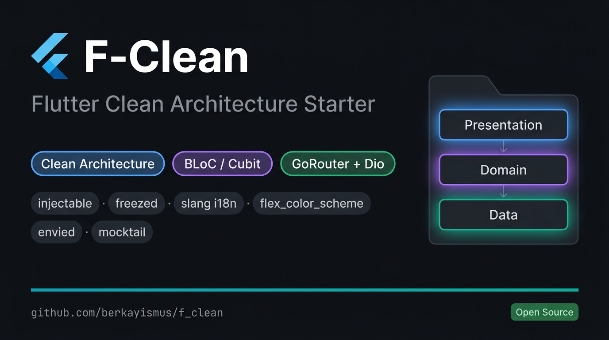

<p align="center">
  
</p>

# F-Clean

> **[English](#english) | [Türkçe](#türkçe)**

---

<a name="english"></a>

# F-Clean — Flutter Clean Architecture Starter

A production-ready Flutter SaaS MVP boilerplate built with **Clean Architecture**, **BLoC/Cubit**, **GoRouter**, **Dio**, and **injectable**.

## Table of Contents

- [Tech Stack](#tech-stack)
- [Project Structure](#project-structure)
- [Getting Started](#getting-started)
- [Key Commands](#key-commands)
- [Architecture Overview](#architecture-overview)
- [Documentation](#documentation)

---

## Tech Stack

| Category | Package | Purpose |
|---|---|---|
| State Management | `flutter_bloc` | BLoC and Cubit |
| DI | `injectable` + `get_it` | Dependency injection |
| Network | `dio` + `pretty_dio_logger` | HTTP client |
| Navigation | `go_router` | Declarative routing |
| Local Storage | `flutter_secure_storage` | Token storage |
| Local Storage | `shared_preferences` | Key-value persistence |
| Functional | `dartz` | `Either<Failure, T>` return type |
| Models | `freezed` + `json_annotation` | Immutable model classes |
| Localization | `slang` + `slang_flutter` | Type-safe i18n |
| Theming | `flex_color_scheme` | Material 3 theme system |
| Environment | `envied` | Secure `.env` file reading |
| Push Notifications | `flutter_local_notifications` | Local notifications |
| Testing | `bloc_test` + `mocktail` | BLoC/Cubit unit tests |

---

## Project Structure

```
lib/
├── main.dart                  # Application entry point
├── app.dart                   # MaterialApp.router, theme, localization
├── core/
│   ├── api/                   # Dio client, interceptors, token storage
│   ├── di/                    # GetIt setup, CoreModule
│   ├── env/                   # DevEnv, ProdEnv, AppConfig
│   ├── error/                 # Exception and Failure classes
│   ├── l10n/                  # Slang JSON source files
│   ├── notifications/         # NotificationService
│   ├── router/                # GoRouter and AppRoutes constants
│   ├── theme/                 # AppTheme, AppThemeExtension
│   └── utils/                 # AppConstants, extensions
└── features/
    └── <feature>/
        ├── data/
        │   ├── datasources/   # Abstract + impl (same file)
        │   ├── models/        # Freezed models with .toEntity()
        │   └── repositories/  # RepositoryImpl
        ├── domain/
        │   ├── entities/      # Pure Dart classes, Equatable
        │   ├── repositories/  # Abstract repository interfaces
        │   └── usecases/      # One class per use case
        └── presentation/
            ├── bloc/          # XBloc, XEvent, XState (or cubit/)
            ├── pages/         # XPage (provides BLoC), _XView (consumes BLoC)
            └── widgets/       # Sub-widgets
```

---

## Getting Started

### Prerequisites

- Flutter SDK (stable channel)
- Dart SDK
- Android Studio / Xcode (for device/emulator)

### Setup

**1. Clone the repository**

```bash
git clone <repo-url>
cd f_clean
```

**2. Install dependencies**

```bash
flutter pub get
```

**3. Create environment files**

```bash
# Development
echo "API_BASE_URL=https://api.dev.example.com" > .env.dev

# Production
echo "API_BASE_URL=https://api.example.com" > .env.prod
```

> `.env` files are in `.gitignore` and must never be committed.

**4. Run code generation**

```bash
dart run build_runner build --delete-conflicting-outputs
```

**5. Run the app**

```bash
flutter run
```

---

## Key Commands

```bash
# Install dependencies
flutter pub get

# Code generation (Freezed, injectable, slang, envied)
dart run build_runner build --delete-conflicting-outputs

# Code generation — watch mode (during development)
dart run build_runner watch --delete-conflicting-outputs

# Run all tests
flutter test

# Run a single test file
flutter test test/unit/auth/auth_bloc_test.dart

# Coverage report
flutter test --coverage
genhtml coverage/lcov.info -o coverage/html

# Static analysis
flutter analyze

# Auto-fix lint issues
dart fix --apply
```

---

## Architecture Overview

The project follows **Clean Architecture** with three distinct layers:

- **Domain** — Pure Dart business logic. Entities, repository interfaces, and use cases. No Flutter or third-party dependencies.
- **Data** — Implements domain interfaces. Handles network calls (Dio), local storage, and maps models to entities.
- **Presentation** — Flutter UI layer. BLoC/Cubit for state management. Pages provide the BLoC; views consume it.

Error handling flows from `DataSource` → `RepositoryImpl` (via `Either<Failure, T>`) → `BLoC` (via `result.fold(...)`).

---

## Documentation

| Document | Language | Description |
|---|---|---|
| [`docs/ARCHITECTURE.en.md`](docs/ARCHITECTURE.en.md) | English | Full architecture & development guide |
| [`docs/ARCHITECTURE.md`](docs/ARCHITECTURE.md) | Turkish | Tam mimari ve geliştirme rehberi |

---

---

<a name="türkçe"></a>

# F-Clean — Flutter Clean Architecture Başlangıç Şablonu

**Clean Architecture**, **BLoC/Cubit**, **GoRouter**, **Dio** ve **injectable** kullanılarak geliştirilmiş, üretime hazır Flutter SaaS MVP şablonu.

## İçindekiler

- [Teknoloji Yığını](#teknoloji-yığını)
- [Proje Yapısı](#proje-yapısı)
- [Başlangıç](#başlangıç)
- [Sık Kullanılan Komutlar](#sık-kullanılan-komutlar)
- [Mimari Özeti](#mimari-özeti)
- [Belgeler](#belgeler)

---

## Teknoloji Yığını

| Kategori | Paket | Amaç |
|---|---|---|
| State Management | `flutter_bloc` | BLoC ve Cubit |
| DI | `injectable` + `get_it` | Bağımlılık enjeksiyonu |
| Network | `dio` + `pretty_dio_logger` | HTTP istemcisi |
| Navigasyon | `go_router` | Declarative routing |
| Local Storage | `flutter_secure_storage` | Token saklama |
| Local Storage | `shared_preferences` | Basit anahtar-değer saklama |
| Fonksiyonel | `dartz` | `Either<Failure, T>` dönüş tipi |
| Modeller | `freezed` + `json_annotation` | Immutable model sınıfları |
| Lokalizasyon | `slang` + `slang_flutter` | Tip güvenli i18n |
| Tema | `flex_color_scheme` | Material 3 tema sistemi |
| Ortam Değişkenleri | `envied` | `.env` dosyalarından güvenli okuma |
| Push Bildirimleri | `flutter_local_notifications` | Yerel bildirimler |
| Test | `bloc_test` + `mocktail` | BLoC/Cubit testleri |

---

## Proje Yapısı

```
lib/
├── main.dart                  # Uygulama giriş noktası
├── app.dart                   # MaterialApp.router, tema, lokalizasyon
├── core/
│   ├── api/                   # Dio istemcisi, interceptor'lar, token storage
│   ├── di/                    # GetIt kurulumu, CoreModule
│   ├── env/                   # DevEnv, ProdEnv, AppConfig
│   ├── error/                 # Exception ve Failure sınıfları
│   ├── l10n/                  # Slang JSON kaynak dosyaları
│   ├── notifications/         # NotificationService
│   ├── router/                # GoRouter ve AppRoutes sabitleri
│   ├── theme/                 # AppTheme, AppThemeExtension
│   └── utils/                 # AppConstants, extensions
└── features/
    └── <feature>/
        ├── data/
        │   ├── datasources/   # Abstract + impl (aynı dosya)
        │   ├── models/        # Freezed modeller, .toEntity() metodu
        │   └── repositories/  # RepositoryImpl
        ├── domain/
        │   ├── entities/      # Saf Dart sınıfları, Equatable
        │   ├── repositories/  # Abstract repository arayüzü
        │   └── usecases/      # Bir use case = bir sınıf
        └── presentation/
            ├── bloc/          # XBloc, XEvent, XState (veya cubit/)
            ├── pages/         # XPage (BLoC sağlar), _XView (BLoC kullanır)
            └── widgets/       # Alt widget'lar
```

---

## Başlangıç

### Gereksinimler

- Flutter SDK (stable channel)
- Dart SDK
- Android Studio / Xcode (cihaz/emülatör için)

### Kurulum

**1. Depoyu klonla**

```bash
git clone <repo-url>
cd f_clean
```

**2. Bağımlılıkları yükle**

```bash
flutter pub get
```

**3. Ortam dosyalarını oluştur**

```bash
# Development
echo "API_BASE_URL=https://api.dev.example.com" > .env.dev

# Production
echo "API_BASE_URL=https://api.example.com" > .env.prod
```

> `.env` dosyaları `.gitignore`'a eklidir; asla versiyon kontrolüne eklenmemelidir.

**4. Kod üretimini çalıştır**

```bash
dart run build_runner build --delete-conflicting-outputs
```

**5. Uygulamayı çalıştır**

```bash
flutter run
```

---

## Sık Kullanılan Komutlar

```bash
# Bağımlılıkları yükle
flutter pub get

# Code generation (Freezed, injectable, slang, envied)
dart run build_runner build --delete-conflicting-outputs

# Code generation — watch mode (geliştirme sırasında)
dart run build_runner watch --delete-conflicting-outputs

# Testleri çalıştır
flutter test

# Tek test dosyası çalıştır
flutter test test/unit/auth/auth_bloc_test.dart

# Coverage raporu
flutter test --coverage
genhtml coverage/lcov.info -o coverage/html

# Analiz
flutter analyze

# Lint sorunlarını otomatik düzelt
dart fix --apply
```

---

## Mimari Özeti

Proje üç katmanlı **Clean Architecture** prensibini uygular:

- **Domain** — Saf Dart iş mantığı. Entity'ler, repository arayüzleri ve use case'ler. Flutter veya üçüncü taraf bağımlılığı yoktur.
- **Data** — Domain arayüzlerini uygular. Network çağrılarını (Dio), yerel depolamayı yönetir ve modelleri entity'lere dönüştürür.
- **Presentation** — Flutter UI katmanı. State yönetimi için BLoC/Cubit kullanır. Page BLoC'u sağlar; View ise tüketir.

Hata yönetimi `DataSource` → `RepositoryImpl` (`Either<Failure, T>` aracılığıyla) → `BLoC` (`result.fold(...)` aracılığıyla) akışıyla gerçekleşir.

---

## Belgeler

| Doküman | Dil | Açıklama |
|---|---|---|
| [`docs/ARCHITECTURE.en.md`](docs/ARCHITECTURE.en.md) | İngilizce | Full architecture & development guide |
| [`docs/ARCHITECTURE.md`](docs/ARCHITECTURE.md) | Türkçe | Tam mimari ve geliştirme rehberi |
